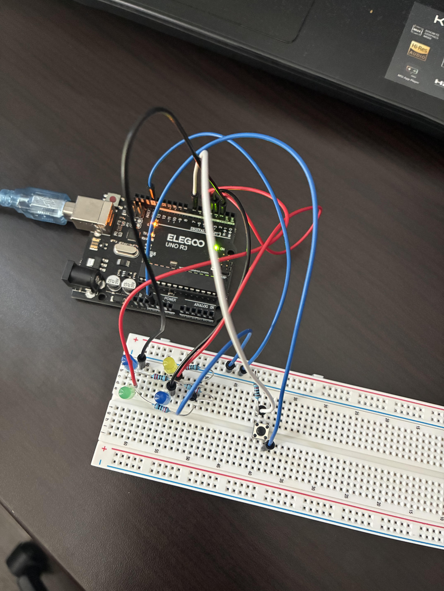

# Arduino LED Project

## What It Does
This project lets you control light patterns with a button. When you press the button, both real LEDs and screen images change together.

## How It Works
- Press the button to change light patterns
- Both real LEDs and screen display change together
- Three patterns: All On, First LED Only, All Off

## What You Need
- Arduino board
- 2 LEDs (blue and green)
- 1 pushbutton
- Resistors and wires
- Computer with Chrome browser

## Try It Yourself
1. Connect the LEDs and button to Arduino
2. Upload the code
3. Open the web page
4. Press the button to see the lights change

## Future Ideas
- Add sound effects
- Create more complex patterns
- Make lights respond to sounds or temperature
- Connect multiple sets that work together

